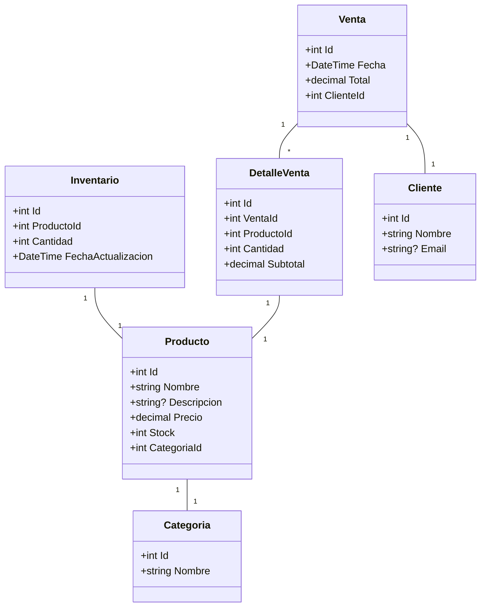

# Team-se-cayo-el-Server

> **Sistema de gestión y registro para supermercados**
> Proyecto universitario desarrollado en **C#/.NET 8** con herramientas open-source.

---

## 📌 Descripción
Este proyecto tiene como objetivo implementar un sistema de gestión para supermercados, enfocado en:
- **Inventario**: Registro y control de productos.
- **Ventas**: Gestión de transacciones y facturación.
- **Productos**: Catálogo y categorización.

---

## 🛠 Requisitos Previos
Para ejecutar este proyecto, necesitas:
- [.NET 8 SDK](https://dotnet.microsoft.com/download) (gratis).
- [SQLite](https://www.sqlite.org/index.html) (incluido en el proyecto).
- [EF Core Tools](https://docs.microsoft.com/en-us/ef/core/cli/dotnet) (gratis).
  ```bash
  dotnet tool install --global dotnet-ef
  ```

---

## 🚀 Cómo Compilar y Ejecutar
1. Clona el repositorio:
   ```bash
   git clone https://github.com/Sandoval-Code/Team-se-cayo-el-Server.git
   cd Team-se-cayo-el-Server
   ```
2. Restaura las dependencias:
   ```bash
   dotnet restore
   ```
3. Compila el proyecto:
   ```bash
   dotnet build
   ```
4. Ejecuta la aplicación (si hay un proyecto de consola):
   ```bash
   dotnet run --project src/TeamSeCayoElServer.Console
   ```

---

## 📂 Estructura del Proyecto
```
Team-se-cayo-el-Server/
├── .github/                  # Configuración de GitHub
├── src/                      # Código fuente
│   ├── TeamSeCayoElServer/   # Lógica de negocio
│   └── TeamSeCayoElServer.Tests/ # Pruebas unitarias
├── docs/                     # Documentación
├── .gitignore                # Archivos ignorados
├── README.md                 # Este archivo
├── CONTRIBUTING.md           # Normas para contribuir
└── TeamSeCayoElServer.sln    # Solución de Visual Studio
```

---

## 📊 Diagrama de Clases (Mermaid)


---

## 🤝 Contribuir
Si quieres contribuir, revisa el archivo [CONTRIBUTING.md](CONTRIBUTING.md).

---

## 📜 Licencia
Este proyecto es parte de un trabajo universitario y usa herramientas open-source. Consulta los términos de las licencias de las tecnologías utilizadas.
